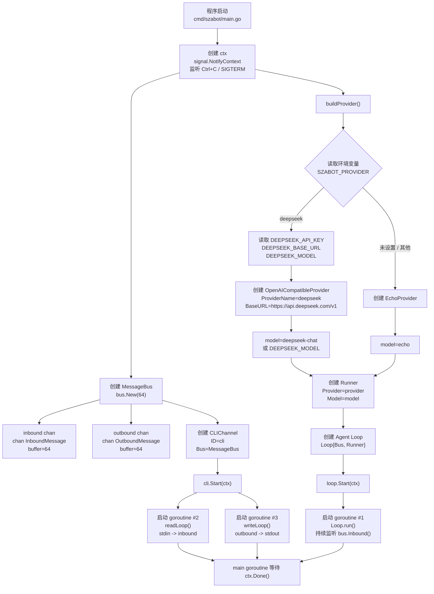
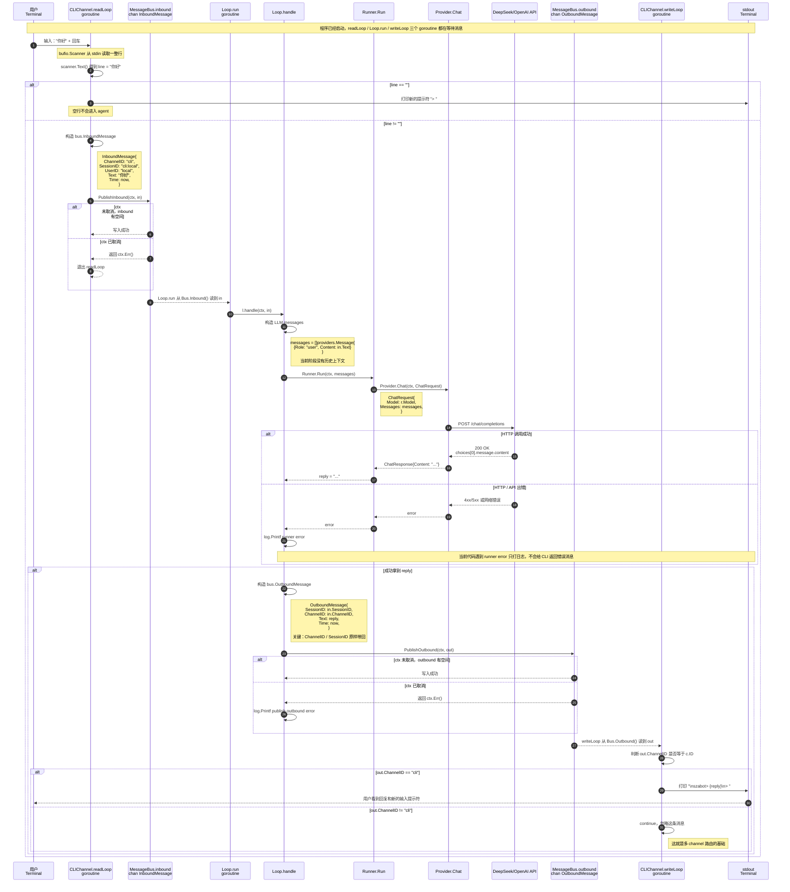
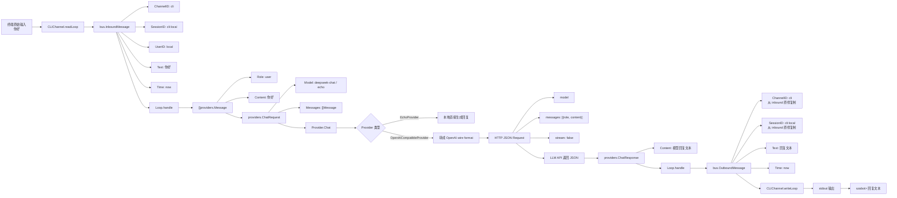
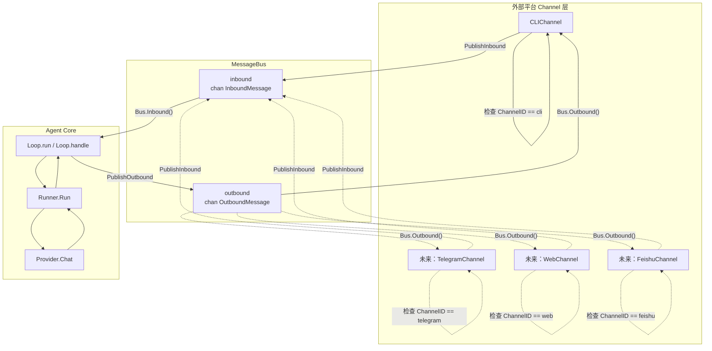
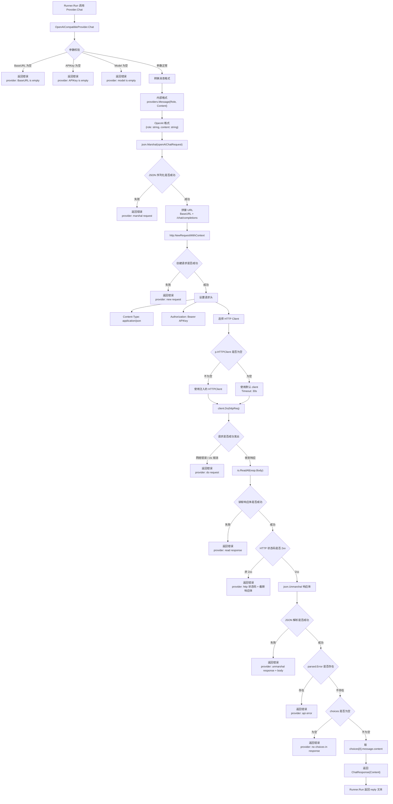
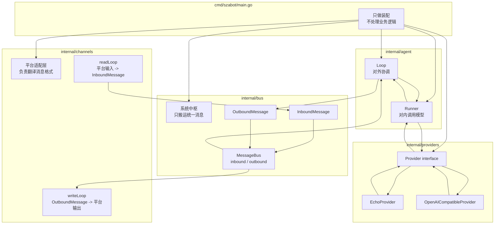
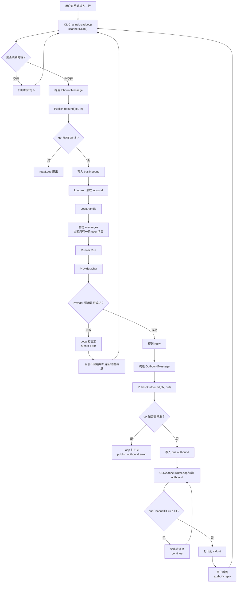

## 从命令行发送一条消息的完整处理链路

本文档用于归档 `szabot` 中，从命令行输入一条消息，到最终在终端打印回复的完整处理流程。

涉及的核心文件：

- [main.go](/Users/ziangsun/Documents/szabot/cmd/szabot/main.go)
- [cli.go](/Users/ziangsun/Documents/szabot/internal/channels/cli.go)
- [queue.go](/Users/ziangsun/Documents/szabot/internal/bus/queue.go)
- [events.go](/Users/ziangsun/Documents/szabot/internal/bus/events.go)
- [loop.go](/Users/ziangsun/Documents/szabot/internal/agent/loop.go)
- [runner.go](/Users/ziangsun/Documents/szabot/internal/agent/runner.go)
- [provider.go](/Users/ziangsun/Documents/szabot/internal/providers/provider.go)
- [openai_compatible.go](/Users/ziangsun/Documents/szabot/internal/providers/openai_compatible.go)

### 1. 启动装配图：`main` 把所有模块串起来



这张图的重点是：

- `main` 不处理业务，只负责装配对象。
- 真正干活的是三个 goroutine：
  - `CLIChannel.readLoop`
  - `agent.Loop.run`
  - `CLIChannel.writeLoop`
- `MessageBus` 是中间的交通枢纽。

### 2. 运行时链路图：用户敲一行消息之后发生什么



### 3. 数据结构流转图：一条文本如何变形



用户输入不是直接传给 Provider 的，它经过了以下几层包装：

```text
stdin line
  -> bus.InboundMessage
  -> []providers.Message
  -> providers.ChatRequest
  -> OpenAI HTTP JSON
  -> providers.ChatResponse
  -> bus.OutboundMessage
  -> stdout
```

### 4. Bus 内部图：为什么它能解耦

`MessageBus` 在 [queue.go](/Users/ziangsun/Documents/szabot/internal/bus/queue.go) 里，本质上就是两条 Go channel：



这里的设计好处是：

- Channel 只管平台格式和统一消息格式之间的翻译。
- Agent 只管处理统一消息。
- Bus 只管搬运消息。
- 新增 Telegram / Web / 飞书，不需要改 `Loop` 和 `Runner`。

### 5. Provider 调用细节图：DeepSeek 这一层怎么走

对应文件：[openai_compatible.go](/Users/ziangsun/Documents/szabot/internal/providers/openai_compatible.go)



### 6. 当前架构的职责边界图



一句话概括：

**Channel 负责接人话，Bus 负责搬消息，Loop 负责调度，Runner 负责跑模型，Provider 负责对接具体模型服务。**

### 7. 带错误分支的完整流程图



### 8. 最终一句话版

这条链路本质是：

```text
命令行输入
  -> CLIChannel.readLoop
  -> bus.InboundMessage
  -> MessageBus.inbound
  -> Agent Loop
  -> Runner
  -> Provider
  -> LLM API / Echo
  -> Runner
  -> Agent Loop
  -> bus.OutboundMessage
  -> MessageBus.outbound
  -> CLIChannel.writeLoop
  -> 命令行输出
```

关键设计点是：

- `ChannelID` 是回信地址。
- `SessionID` 是会话身份。
- `MessageBus` 是解耦核心。
- `Loop` 不关心消息来自 CLI 还是其他平台。
- `Runner` 不关心模型是 DeepSeek 还是 Echo。
- `Provider` 不关心消息最终要回到哪里。
