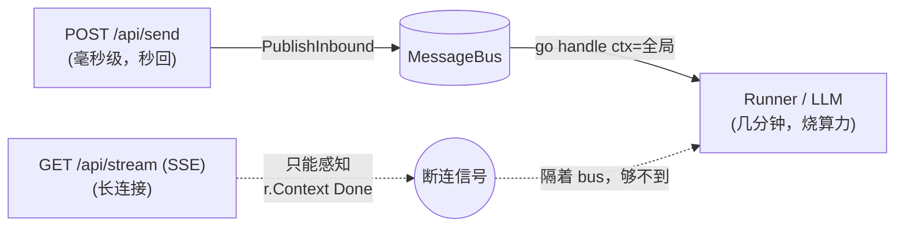
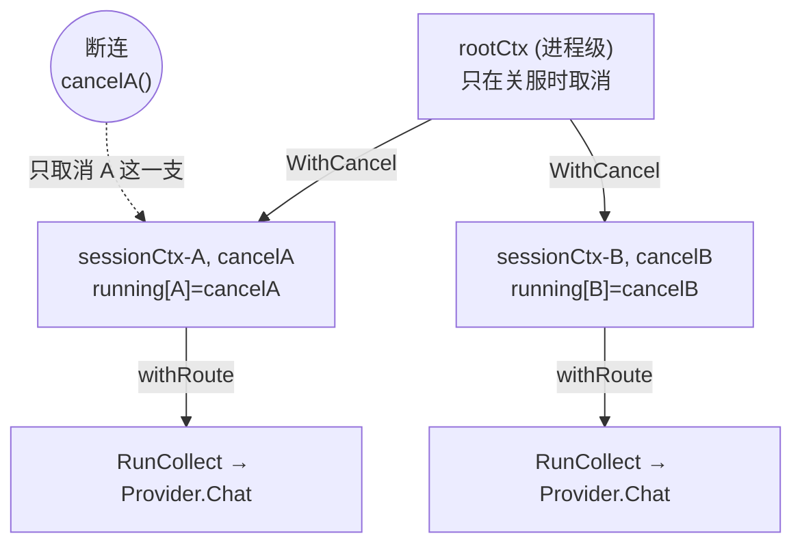
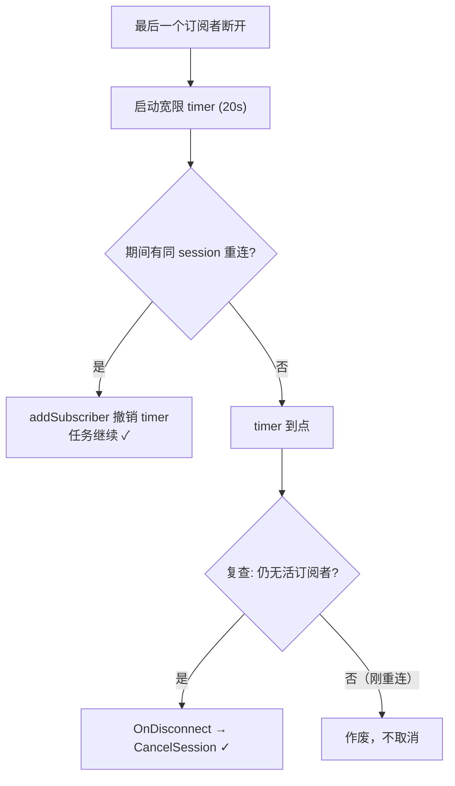

# 本次改动总结：客户端断连感知 + 下游 Agent 任务取消

本文档归档一次迭代中对 `szabot` 所做的一项能力补齐：**当 Web 客户端关闭页面、切换会话或网络断开时，服务端能感知断连，并（在满足条件下）取消该会话正在运行的下游 Agent Runner / LLM 请求，避免用户已离开却还在白烧算力。**

在此之前，"感知断连"发生在最外层的 SSE handler，而"真正在烧算力的任务"跑在 `Loop` 的 goroutine 里，两者中间隔着一条完全异步、无反向信号的 `MessageBus`——断连信号传不到任务，任务也就停不下来。

涉及的核心文件：

- [loop.go](../../internal/agent/loop.go) — 运行注册表 + `CancelSession`（含 pending 豁免）+ `WithCancel` 派生 + `context.Canceled` 日志降级
- [web.go](../../internal/channels/web.go) — 订阅者判空 + 宽限期 timer + 重连撤销 + `OnDisconnect` 回调
- [main.go](../../cmd/szabot/main.go) — wiring：把 `WebChannel.OnDisconnect` 接到 `Loop.CancelSession`
- [loop_cancel_test.go](../../internal/agent/loop_cancel_test.go) — 取消相关单元测试（新增）
- [web_test.go](../../internal/channels/web_test.go) — 宽限期 / 重连 / 多标签页测试

---

## 第一部分：问题背景

### 1.1 现状：三条独立的"命"，各挂各的 ctx

szabot 的 Web 交互是**命令-查询分离**的两条独立 HTTP 请求，加上一条独立的处理 goroutine，一共三条生命线：

| | 通道 | 方法 | 生命周期 | 作用 |
|---|---|---|---|---|
| **发送** | `POST /api/send` | 请求-响应，秒回即结束 | 毫秒级 | 把用户输入丢进 bus |
| **处理** | `go l.handle(ctx, in)` | bus 触发的独立 goroutine | 几秒~几分钟 | 加载历史 → 调 Runner → 回写历史 |
| **接收** | `GET /api/stream` (SSE) | 长连接 | 跟随会话存活 | 持续接收 agent 事件流 |

三者唯一的纽带是 **`SessionID`** + **`MessageBus`**，彼此之间**没有 HTTP 层面的关联**。

### 1.2 为什么无法"请求内联"取消

最直觉的做法是让任务 ctx 派生自请求 ctx（request-scoped），请求断开 ctx 树自动取消。但在 szabot 里行不通：

- `POST /api/send` 活不过几毫秒，发完 `PublishInbound` 就返回——它的 `r.Context()` 早已 Done，而 agent 还没开始跑；
- `handle` 挂的是 `WebChannel.Start` 传入的**进程级全局 ctx**，不是任何一条请求的 ctx；
- 唯一的长连接是 SSE，但它和任务之间隔着 bus，SSE handler 手里只有一个 `SessionID`，**没有指向那个正在跑的 goroutine 的句柄**。



**结论**：断连信号天然只出现在 SSE 侧，而它与任务之间没有直接的 ctx 父子关系。只能用 `SessionID` 做"跨通道的间接引用"，架一座桥。

### 1.3 改动前 ctx 链路的关键缺陷

`handle` 里的派生只用了 `context.WithValue`：

```go
runCtx := withRoute(ctx, in.SessionID, in.ChannelID) // 只 WithValue，挂数据
l.Runner.RunCollect(runCtx, messages, sink)
```

`context.WithValue` 派生出的子 ctx **只挂数据、没有独立取消能力**，它只会跟着原始全局 ctx 一起被取消。也就是说：

> 父子链是通的，但**缺了一个"每 session 独立、可单独取消的中间父节点"**。想取消它只能取消全局 ctx——那会把整个进程所有 session 的任务全干掉。

---

## 第二部分：解决方案总览

采用业界标准的 **注册表（Registry）+ 显式取消** 模式，配合 **宽限期（Grace Period）**：

1. **SSE 侧感知断连**（`<-r.Context().Done()`）——唯一能感知的地方；
2. **注册表按 `SessionID` 查到任务的 `CancelFunc`**——用 `SessionID` 做跨通道的间接引用；
3. **调 `cancel()` 取消子 ctx**——沿 ctx 树向下广播，中断下游 Runner / LLM 请求。

改造后的 ctx 树（这才是要的父子关系）：



`cancelA()` 一调 → `sessionCtx-A.Done()` 关闭 → 其所有子孙全部 Done → Go 的 `http.Client` 发出的那个 LLM 请求连接立刻中断，token 停烧；B 不受影响。

---

## 第三部分：任务侧改造（`loop.go`）

### 3.1 运行注册表

```go
type Loop struct {
    // ...
    mu      sync.Mutex
    pending map[string]*pendingAsk   // 正在等用户回答的 session（已有）
    running map[string]*runHandle    // 正在跑 Runner 的 session → 取消句柄（新增）
}

type runHandle struct {
    cancel context.CancelFunc
}
```

**为什么 value 存 `*runHandle`（内含 `CancelFunc`）而不是存 context 本身？**

`context.Context` 接口只能"监听"取消（`Done()` 返回只读 channel），**没有任何主动取消的方法**——这是 Go 刻意的"取消权 / 监听权分离"设计。要从外部主动取消，必须持有 `WithCancel` 返回的那把"开关"，即 `CancelFunc`。存 context 既取消不了、又冗余（context 已通过参数一路传给下游，下游自己在监听它）。

用指针 `*runHandle` 而非裸 `cancel`，是为了注销时能校验"取消的是不是当前这一次"，避免同 session 后来任务登记的句柄被旧任务的 `defer` 误删（与 `pending` 里比对 `wait` 指针同理）。

### 3.2 `handle` 里派生可取消 ctx + 注册/注销

把只 `WithValue` 的派生升级为 `WithCancel` + `WithValue`：

```go
runCtx, cancel := context.WithCancel(ctx)
handle := &runHandle{cancel: cancel}
l.registerRun(in.SessionID, handle)
defer l.unregisterRun(in.SessionID, handle)
runCtx = withRoute(runCtx, in.SessionID, in.ChannelID)

result, err := l.Runner.RunCollect(runCtx, messages, sink)
```

> **注意**：`WithCancel` 返回的 `cancel` **必须最终被调用**（哪怕任务正常结束），否则 context 内部关联的资源会泄漏，`go vet` 也会告警。这里任务无论正常结束、出错还是被取消，都会走到 `defer` 并释放 ctx。

### 3.3 `CancelSession`：对外的取消入口 + pending 豁免

```go
func (l *Loop) CancelSession(sessionID string) {
    l.mu.Lock()
    _, waiting := l.pending[sessionID]
    h := l.running[sessionID]
    l.mu.Unlock()

    if waiting {
        return // 挂起等回答的会话，豁免断连取消
    }
    if h != nil {
        h.cancel()
    }
}
```

**pending 豁免**：若该 session 正处于 `ask_user_question` 挂起态（在等用户回答），断连不取消它。因为 `Ask` 阻塞等回答时，用户"人不在页面"是正常的（在思考、查资料、切走），此时 kill 掉体验很差。

### 3.4 `context.Canceled` 日志降级

```go
if err != nil {
    if errors.Is(err, context.Canceled) {
        // 客户端断连触发的主动取消，属预期结果而非故障
        log.Printf("[loop] session=%s canceled (client gone)", in.SessionID)
    } else {
        log.Printf("[loop] runner error session=%s: %v", in.SessionID, err)
    }
    return
}
```

取消是我们**自己按下的开关**，不是故障。降级为普通信息日志，避免每次断连都刷一条 error 级日志、误触发告警。另外：被取消的半截对话因提前 `return` 而**不回写 Store**，未答完的内容不会污染 session 历史。

---

## 第四部分：连接侧改造（`web.go`）

### 4.1 为什么必须要有宽限期

SSE / `EventSource` 的"断开"极其频繁且**多为良性**：手机锁屏、切后台、网络抖动、WiFi 切蜂窝、中间代理回收空闲连接……每一次都会触发一次 `r.Context().Done()`，而前端 `EventSource` 会立刻用**同一个 `SessionID`** 自动重连。

> 若"一断就取消"，用户手机锁屏 3 秒，正在跑的 agent 任务就被杀了——灾难性体验。

因此断开后先等宽限期（默认 20s），期间有重连就撤销，到点仍无人才真正取消。

### 4.2 新增字段

```go
type WebChannel struct {
    // ...
    GracePeriod  time.Duration          // 宽限期，默认 20s
    OnDisconnect func(sessionID string)  // 判定客户端离开后的回调（接 Loop.CancelSession）
    graceTimers  map[string]*time.Timer  // 各 session 正在倒计时的宽限 timer
}
```

### 4.3 三个关键行为

**① 多标签页判空（`removeSubscriber`）**：只有该 session 的**最后一个**订阅者也走了，才启动宽限 timer。`subscribers[sessionID]` 本就是集合，天然支持多标签页。

```go
delete(set, s)
if len(set) > 0 {
    return // 还有别的活连接（如多标签页），不取消
}
// 最后一个也走了 → 启动宽限 timer
w.graceTimers[sessionID] = time.AfterFunc(grace, func() { w.onGraceExpired(sessionID) })
```

**② 重连撤销（`addSubscriber`）**：新订阅者接入时，若该 session 有正在倒计时的 timer，立即停掉。

```go
if t := w.graceTimers[s.sessionID]; t != nil {
    t.Stop()
    delete(w.graceTimers, s.sessionID)
}
```

**③ 到点复查（`onGraceExpired`）**：timer 触发后**再查一次**订阅者集合是否仍为空，堵住"快到点时刚好有人重连"的竞态窗口，确认无人才回调 `OnDisconnect`。



---

## 第五部分：装配（`main.go`）

一行接线：

```go
web := &channels.WebChannel{
    ID:   "web",
    Bus:  b,
    Addr: addr,
    OnDisconnect: loop.CancelSession, // 断连（过宽限期无重连）→ 取消该会话下游任务
}
```

---

## 第六部分：最终取消判定

一个任务被取消，必须**同时**满足以下条件：

1. 该 `SessionID` 名下**所有** SSE 订阅者都断开了（集合空）；
2. 且断开后**过了宽限期仍无重连**；
3. 且该 `SessionID` **不处于 `ask_user_question` 挂起态**；
4. 取消后日志**降级**为普通信息，不当 error 报。

这套下来，既能省掉"用户真走了"的算力，又不会误杀"网络抖一下 / 锁屏 / 刷新"的正常场景。

---

## 第七部分：测试覆盖

**`loop_cancel_test.go`（新增）：**

- `TestCancelSessionInterruptsRunner` — `CancelSession` 能取消正在运行的 handle，下游 `Provider.Chat`（挂在 runCtx 上）随之收到取消并返回，且从 `running` 注册表注销；
- `TestCancelSessionExemptsPending` — pending 态豁免取消；
- `TestCancelSessionUnknownIsNoop` — 对未知 session 取消是安全的 no-op；
- `TestCancelSessionErrorIsContextCanceled` — 取消导致的错误确为 `context.Canceled`。

**`web_test.go`（补充）：**

- `TestDisconnectCancelsAfterGrace` — 断开过宽限期后触发 `OnDisconnect`；
- `TestDisconnectNotCancelledImmediately` — 宽限期内不立即取消；
- `TestReconnectCancelsGraceTimer` — 宽限期内重连撤销 timer，不取消；
- `TestMultiTabNoCancelWhileOthersAlive` — 多标签页时断开一个不取消。

全部测试通过（含 `go test -race`）。

---

## 第八部分：遗留可选项

被中断的半截对话目前**不落盘**（提前 `return` 跳过 `Store.Append`）。若未来需要"重连后接着看断连期间的输出"，需要额外做**输出缓冲 + `Last-Event-ID` 断点续传**（SSE 原生支持 `Last-Event-ID` 头，重连时告诉服务端"我收到哪了"，服务端补发）。这是更大的一块，按需再做。
